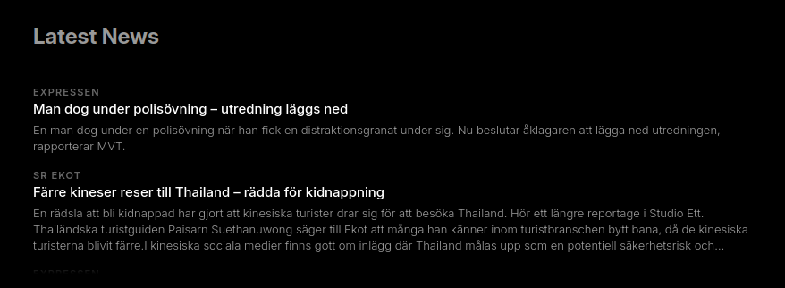

# mirrordash-news

An RSS and Atom news feed reader module for MirrorDash. It fetches headlines and preambles from configurable XML feeds in parallel and displays them in a responsive, snapped HUD layout.

## Features
- **RSS & Atom Support**: Clean XML parsing that supports standard RSS channels and Atom entry namespaces.
- **HTML/XML Tag Stripping**: Automatically cleans up and strips HTML tags, formatting entities, and extra whitespace from titles and preambles.
- **Parallel Fetching**: Loads all configured news sources simultaneously in background threads for rapid refreshes.
- **Glanceable HUD Design**: Snaps layout alignments (left/right/center) depending on its regional position on the mirror, and wraps text cleanly using CSS line-clamping.

## Installation

```bash
uv pip install -e .
```

## Screenshot



## License
[PolyForm Noncommercial License 1.0.0](LICENSE.md)
